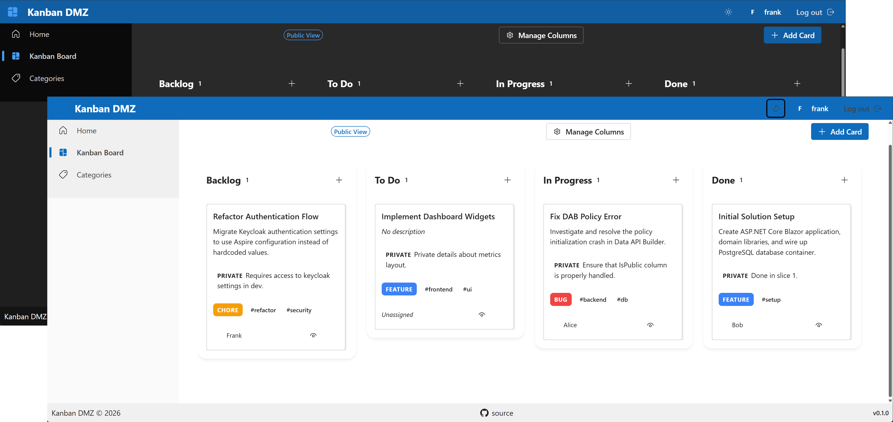

# Kanban DMZ

[&logo=github)](https://github.com/fboucher/kanban-dmz/actions/workflows/test.yml?query=branch%3Amain)
[&logo=github)](https://github.com/fboucher/kanban-dmz/actions/workflows/test.yml?query=branch%3Adev)
[](https://hub.docker.com/repository/docker/fboucher/kanban-dmz-web)

[](https://dotnet.microsoft.com/)
[](https://learn.microsoft.com/en-us/dotnet/aspire/)
[](https://learn.microsoft.com/en-us/azure/data-api-builder/)
[](https://www.fluentui-blazor.net/)
[](https://www.keycloak.org/)

A secure, visual project board featuring public and private visibility zones (DMZ), configurable columns, card categories, and built-in OIDC authentication.



## Overview

Kanban DMZ is designed to provide project tracking with differentiated visibility:
* **Public View**: Unauthenticated visitors can view public boards, public cards, and public descriptions.
* **Private View**: Authenticated users can log in via Keycloak to access private board content, view private card descriptions, edit cards, manage board columns, and configure card categories.

---

## Key Features

* **Public & Private Visibility**: Control access dynamically. Every card supports separate public and private descriptions. Cards can be toggled between public and private visibility zones.
* **Column Management**: Authenticated users can add, rename, reorder, and delete columns to fit their team's workflow.
* **Category Management**: Authenticated users can manage categories (e.g. Bug, Feature, Chore). Deletions are safely blocked if a category is currently referenced by cards.
* **OIDC Authentication**: Authenticated user session security backed by Keycloak OpenID Connect.
* **Orchestration Architecture**: Backend minimal APIs serve business logic orchestrations (e.g. board creation, visibility changes) while Data API Builder (DAB) serves standard data CRUD operations directly over PostgreSQL.

---

## Technology Stack

* **Frontend**: .NET Blazor Server (Interactive Server Render Mode)
* **Design & UI**: Microsoft Fluent UI Blazor Components v5
* **Data Access**: Microsoft Data API Builder (DAB) REST Engine
* **Database**: PostgreSQL DB
* **Authentication**: Keycloak IAM OIDC Provider
* **Orchestration**: .NET Aspire Orchestration Dashboard
* **CI & Pipelines**: GitHub Actions Workflow
* **Testing**: xUnit Unit Tests & Testcontainers API Integration Tests (Postgres + DAB)

---

## Getting Started

### Prerequisites
* [.NET 10 SDK](https://dotnet.microsoft.com/)
* [Docker Desktop](https://www.docker.com/products/docker-desktop/) (required to run container resources)

### Run the App Locally
Orchestration is handled natively by .NET Aspire. Simply start the AppHost project:
```bash
dotnet run --project src/KanbanDmz.AppHost
```
This command spins up the AppHost launcher and automatically launches Postgres, Keycloak, DAB, and the Blazor Webapp. You can access the local Aspire dashboard from the URL printed in the console.

### Running Tests
To run unit tests and Testcontainers integration tests:
```bash
dotnet test src
```
Testcontainers will automatically spin up isolated Postgres and DAB Docker instances in the background during the test run (no manual setup required).
